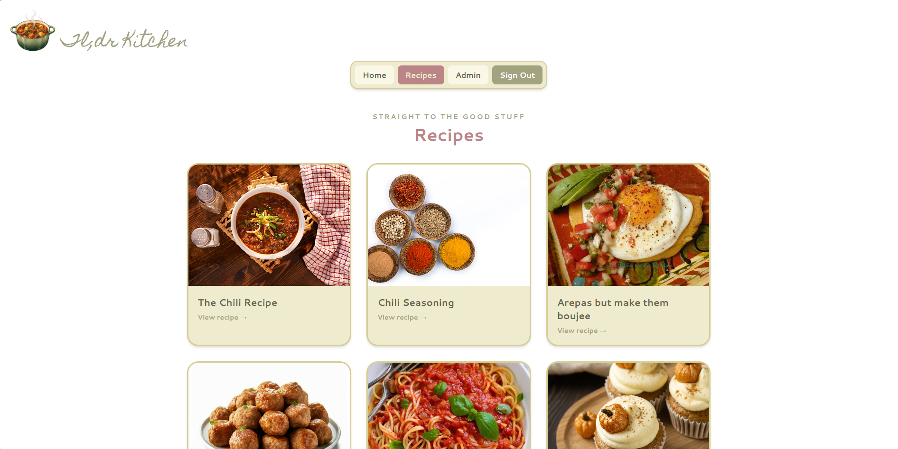

# Tl;dr Kitchen

Tl;dr Kitchen is a responsive recipe blog built with React and TypeScript. Visitors can browse recipes without creating an account, while authenticated users can access a protected admin dashboard.

## Screenshots

### Tl;dr Kitchen Blog App Mobile


### Tl;dr Kitchen Blog App Desktop



## Features

- Responsive home, recipe listing, and individual recipe pages
- Dynamic recipe routes using URL slugs
- Supabase authentication
- Protected `/admin` route
- Automatic redirect to `/login` for unauthenticated admin visitors
- Conditional navigation based on authentication status
- Responsive navigation and recipe cards
- Custom 404 page for unknown routes

## Demo Admin Access

Use the following demo credentials on the **Login** page to access the protected admin feature:

```text
Username: superchef
Password: password123
```

> These credentials are for demonstrating the assignment's authentication and protected-route functionality only. Do not reuse them for a production account.

After logging in, select **Admin** in the navigation menu or visit `/admin` directly.

## Routes

| Route | Access | Description |
| --- | --- | --- |
| `/` | Public | Home page |
| `/blogs` | Public | Recipe collection |
| `/blogs/:slug` | Public | Individual recipe page |
| `/login` | Public | Admin login page |
| `/admin` | Authenticated users only | Admin dashboard |
| `*` | Public | 404 Not Found page |

## Built With

- React
- TypeScript
- Vite
- React Router
- Tailwind CSS
- Supabase Authentication

## Getting Started

### Prerequisites

- Node.js
- npm
- A Supabase project containing the demo user

### Installation

1. Clone the repository:

   ```bash
   git clone <repository-url>
   cd blog-app
   ```

2. Install the dependencies:

   ```bash
   npm install
   ```

3. Create a `.env` file in the project root:

   ```env
   VITE_SUPABASE_URL=your_supabase_project_url
   VITE_SUPABASE_PUBLISHABLE_KEY=your_supabase_publishable_key
   ```

4. Start the development server:

   ```bash
   npm run dev
   ```

5. Open the local address displayed in the terminal.

## Authentication Behavior

Recipe content is public and does not require authentication. When an unauthenticated visitor attempts to open `/admin`, React Router redirects them to `/login`. After a successful login, the navigation displays links for the Admin Dashboard and signing out.

The login form accepts the username `superchef`. The authentication provider converts it to the demo account email expected by Supabase before signing the user in.

## Available Scripts

```bash
npm run dev
```

Starts the Vite development server.

```bash
npm run build
```

Runs the TypeScript build and creates a production bundle.

```bash
npm run lint
```

Runs ESLint.

```bash
npm run preview
```

Previews the production build locally.

## Production Build

To verify that the application compiles successfully:

```bash
npm run build
```

The generated production files will be placed in the `dist` directory.
